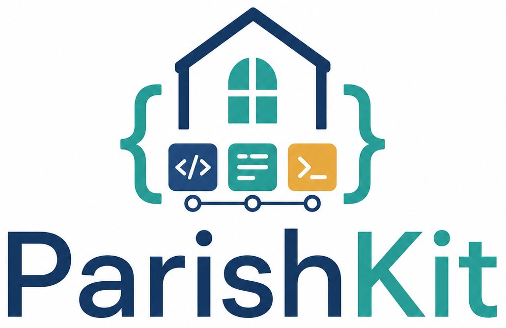

# ParishKit

ParishKit is an installable Python package and collection of command-line
tools for Catholic parish operations automation.

The project name is ParishKit. The repository and Python distribution name are
`parishkit`.

This repository is intentionally parish-neutral. Parish names, domains,
ministry mappings, external object IDs, credentials, and deployment paths belong
in runtime configuration, not in reusable package code.

More setup, validation, and operator documentation will be added as the project
is built out.
