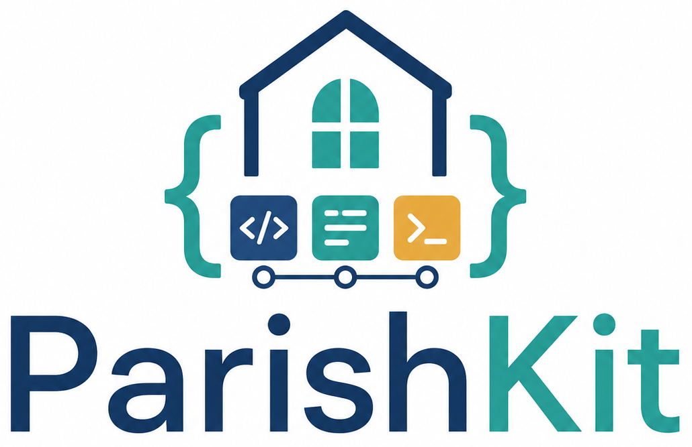

# ParishKit



ParishKit is a collection of command-line tools that a parish IT administrator
can run on a schedule to keep a parish's various cloud services in sync with
ParishSoft.

ParishSoft is the system of record. It holds your parishioner, family,
ministry, stewardship, and financial data. ParishKit treats ParishSoft as the
single source of truth and copies the relevant pieces of that data *outward* to
the other services your parish uses, such as:

- **Google Workspace** (Google Groups, Google Drive/Sheets, Google Calendar)
- **Constant Contact** email lists
- **Status and error notifications** by email and Slack

You configure each tool once, point it at your credentials, and then schedule it
to run automatically (for example, every 15 minutes or once a night). After
that, changes you make in ParishSoft flow out to the other systems on their own.

This repository is intentionally **parish-neutral**: it contains no parish
names, domains, ministry names, object IDs, or credentials. All of that lives in
configuration files and credential files that *you* create on your own server
and that never go into this repository.

## Table of contents

- [What the tools do](#what-the-tools-do)
- [How ParishKit works](#how-parishkit-works)
- [Before you begin](#before-you-begin)
- [Installing ParishKit](#installing-parishkit)
- [The runtime directory layout](#the-runtime-directory-layout)
- [Setting up credentials](#setting-up-credentials)
  - [ParishSoft API key](#parishsoft-api-key)
  - [Google Cloud and Google Workspace](#google-cloud-and-google-workspace)
  - [Constant Contact](#constant-contact)
  - [Slack notifications (optional)](#slack-notifications-optional)
  - [Email notifications (optional)](#email-notifications-optional)
- [Configuring a tool](#configuring-a-tool)
- [Running a tool](#running-a-tool)
- [Scheduling automated runs](#scheduling-automated-runs)
- [Verifying credentials with smoke tests](#verifying-credentials-with-smoke-tests)
- [Keeping secrets safe](#keeping-secrets-safe)
- [Developer notes](#developer-notes)

## What the tools do

Each tool is a separate command. You only need to install, configure, and run
the ones your parish actually uses. Every tool has its own folder under
`scripts/` with a README and an `example-config.yaml` you can copy and edit.

**Sync tools** (these *write* to other systems):

- **`pk-sync-ps-to-ggroup`** — keeps Google Group membership in step with
  ParishSoft ministries and workgroups. Add someone to a ministry in ParishSoft
  and they are added to the matching Google Group automatically.
- **`pk-sync-ps-to-cc`** — keeps Constant Contact email lists in step with
  ParishSoft workgroups, while respecting people who have unsubscribed.
- **`pk-create-ps-ministry-rosters`** — builds ministry roster tables from
  ParishSoft and uploads them into Google Drive as native Google Sheets.

**Audit and reporting tools:**

- **`pk-validate-gcalendar-reservations`** — reviews pending invitations on
  Google Calendar resource calendars (such as parish rooms) and accepts or
  declines them based on rules you set, including conflict detection.

**Lookup tools** (read-only, handy for spot checks):

- **`pk-query-ps-memfam`** — looks up and prints a ParishSoft family or member
  record.
- **`pk-print-ps-ministries`** — lists the ministry names defined in ParishSoft.

**Scheduler:**

- **`pk-cron-runner`** — the recommended way to run any of the above on a
  schedule. It prevents overlapping runs, enforces timeouts, captures output to
  log files, and can post success/failure summaries to Slack.

## How ParishKit works

A few ideas show up everywhere in ParishKit. Understanding them up front makes
the rest of the setup straightforward.

- **ParishSoft is the source of truth.** ParishKit reads from ParishSoft and
  pushes changes out to the other services. It does not write back into
  ParishSoft. The ParishSoft API key it uses is read-only.

- **One tool, one job, one config file.** Each tool reads a YAML configuration
  file that you pass with `--config`. The config tells the tool which ParishSoft
  ministries/workgroups to read, which Google Groups or Constant Contact lists
  to write, where your credentials live, and so on.

- **Credentials live on disk, not in this repository.** API keys, OAuth tokens,
  and service-account keys are stored as files on your server (by default under
  `/opt/parishkit/credentials/`) with tight permissions. You reference them by
  path from your config.

- **Dry-run first, by default.** Any tool that can change an external system
  refuses to make changes unless you explicitly allow it. The example configs
  ship with `dry_run: true`. A dry run reads everything and reports exactly what
  *would* change, but writes nothing. You flip to live writes only after you
  have reviewed a dry run.

- **Built-in guardrails.** The sync tools will abort instead of making
  surprisingly large deletions (for example, if a ParishSoft workgroup
  unexpectedly comes back empty). You can tune these limits per list/group.

- **Runs unattended, reports when something is wrong.** Once scheduled, the
  tools are meant to run without you watching. They can email a summary when
  they make changes and post to a Slack channel when something fails.

## Before you begin

You will need:

- **A computer that is on a schedule.** This is normally an always-on Linux
  server or virtual machine, but a Mac that stays awake works too. The tools run
  from `cron`, so the machine must be running when the schedule fires.

- **Python 3.12 or newer** installed on that machine.

- **Comfort with a terminal**, or someone who can help with the initial setup.
  Day-to-day operation is automated, but the one-time install and credential
  setup happen at the command line.

- **Administrator access to the services you want to sync.** Depending on which
  tools you use, that means some combination of:
  - A ParishSoft **API key** (you may need to contact ParishSoft to obtain one).
  - **Google Workspace super-administrator** access, to set up a Google Cloud
    project and authorize ParishKit (one-time).
  - A **Constant Contact** account and the ability to create a developer
    application.
  - Optionally, a **Slack** workspace where you can add a bot, for error alerts.

You do not need to know Python or how these REST APIs work internally. This
guide walks through each step.

## Installing ParishKit

ParishKit installs into a self-contained directory tree. The installer creates
that tree, sets up a private Python environment inside it, installs the
ParishKit commands, and places launcher scripts under a `bin/` directory. The
same steps work on Linux and macOS.

1. Get a copy of this repository onto the server:

   ```sh
   git clone https://github.com/<your-org>/parishkit.git
   cd parishkit
   ```

2. Run the installer:

   ```sh
   ./install.py
   ```

   The installer chooses where to put everything (the "install root") in this
   order:

   1. The `--installdir` option, if you pass one.
   2. The `PARISHKIT_ROOT` environment variable, if it is set.
   3. `/opt/parishkit` otherwise.

   For example, to install under your home directory instead of `/opt`:

   ```sh
   ./install.py --installdir "$HOME/parishkit"
   ```

   Or to install under a custom system path:

   ```sh
   PARISHKIT_ROOT=/srv/parishkit ./install.py
   ```

The installer runs as your current user and does not create users or groups. If
the install root needs elevated permissions to create (for example, the default
`/opt/parishkit`), run it with `sudo`:

```sh
sudo ./install.py
```

After it finishes, the ParishKit commands are available as launcher scripts
under `<install-root>/bin/`, for example `/opt/parishkit/bin/pk-sync-ps-to-ggroup`.
Use those full paths in your cron jobs so scheduled runs do not depend on your
shell's `PATH`.

## The runtime directory layout

ParishKit keeps all of its operational files under one root directory. With the
default install root, that tree looks like this:

```text
/opt/parishkit/config/        Your YAML configuration files
/opt/parishkit/credentials/   API keys, tokens, and service-account keys
/opt/parishkit/cache/         Cached ParishSoft responses (speeds up repeat runs)
/opt/parishkit/logs/          Log files written by the tools
/opt/parishkit/reports/       Generated reports
/opt/parishkit/run/           Lock files and small bits of run state
/opt/parishkit/bin/           Launcher scripts for the pk-* commands
```

If you set the `PARISHKIT_ROOT` environment variable, every default path moves
under that root instead. For example, with `PARISHKIT_ROOT=/srv/parishkit`, the
default config directory becomes `/srv/parishkit/config`, credentials become
`/srv/parishkit/credentials`, and so on.

The installer creates these directories with safe permissions:
`credentials/` is `0700` (only you can read it); `config/`, `cache/`, `logs/`,
`reports/`, `run/`, and the install root are `0750`; `bin/` is `0755`.

Every path is also overridable per tool, either with a command-line option or in
the YAML config. `PARISHKIT_ROOT` only changes the *built-in defaults*; any path
you write explicitly in YAML is used exactly as written.

The example file paths throughout this guide use `/opt/parishkit/...`. If you
installed somewhere else, substitute your own install root.

## Setting up credentials

Each external service needs credentials. Store every credential file under your
`credentials/` directory and never commit any of them to git.

Recommended file permissions:

- `0600` (owner read/write only) when only the account that runs the tools needs
  the file.
- `0640` (owner read/write, group read) when a dedicated admin group also needs
  read access.

Never make a credential file or the `credentials/` directory world-readable, and
exclude `credentials/` from routine backups unless your backup system is
approved to hold secrets.

The sections below cover each service. Set up only the ones you need.

### ParishSoft API key

Every ParishSoft-reading tool needs a ParishSoft API key. Parishes generally
have to contact ParishSoft sales or support to purchase or enable API access for
their organization.

Once you have the key, save it as a plain text file outside git:

```sh
# Paste the key into this file, then lock it down.
chmod 600 /opt/parishkit/credentials/parishsoft-api-key.txt
```

Point each tool at the key with the `parishsoft.api_key_file` setting in YAML
(or the `--ps-api-key-file` option). In your config, also set
`parishsoft.expected_organization` to your parish's name as ParishSoft reports
it. ParishKit checks this on startup so a misconfigured deployment cannot
accidentally read or modify the wrong ParishSoft tenant.

You can confirm the key works with the read-only ParishSoft smoke test described
in [Verifying credentials with smoke tests](#verifying-credentials-with-smoke-tests).

### Google Cloud and Google Workspace

This is the most involved setup, but you only do it **once per parish**. The
tools that talk to Google (`pk-sync-ps-to-ggroup`, `pk-create-ps-ministry-rosters`,
`pk-validate-gcalendar-reservations`, and Google Workspace email notifications)
all share the same Google credentials once this is in place.

The goal is to create a *service account* — a non-human Google identity that
ParishKit logs in as — and then authorize it, through *domain-wide delegation*,
to act on behalf of a specific Workspace user when it calls Google APIs.

> **Use a separate Google Cloud project for each parish.** This keeps each
> parish's access, billing, audit logs, and offboarding cleanly separated.

You will need Google Workspace **super-administrator** access to complete the
Workspace Admin steps.

#### Part 1 — Create the Google Cloud project and turn on APIs

1. Sign in to the [Google Cloud Console](https://console.cloud.google.com/).
2. Create a new project for the parish (the project picker at the top of the
   page has a **New Project** button).
3. Write down the **project ID** in your parish's private deployment notes. Do
   not put it in this repository.
4. With the new project selected, enable only the APIs the tools you plan to use
   need. Go to **APIs & Services > Library**, search for each API, and click
   **Enable**:
   - **Google Calendar API** — for `pk-validate-gcalendar-reservations`.
   - **Google Drive API** — for `pk-create-ps-ministry-rosters`.
   - **Admin SDK API** — for `pk-sync-ps-to-ggroup` (Google Group membership).
   - You do **not** need the Gmail API for the current email provider. ParishKit
     sends Workspace email over SMTP with OAuth, not the Gmail API. Enable the
     Gmail API only if you later adopt a Gmail-API-based provider.

#### Part 2 — Create the service account and its key

1. In the Cloud Console, with the parish project selected, go to
   **IAM & Admin > Service Accounts**.
2. Click **Create service account**.
3. Fill in:
   - **Service account name:** `parishkit-automation`
   - **Service account ID:** accept the generated value (or use
     `parishkit-automation`).
   - **Description:** `Service account for ParishKit automation`
4. Click **Create and continue**.
5. On the "Grant this service account access to project" step, **do not grant
   any project roles.** ParishKit's Google access comes from Workspace
   domain-wide delegation and explicit API scopes, not from Cloud IAM roles.
   Click **Continue**, then **Done**.
6. Back on the Service Accounts list, click the new service account to open it.
7. Find and copy its **Unique ID** (a long number shown on the details page,
   also called the **OAuth 2 client ID**). You will paste this into the
   Workspace Admin Console in Part 3. (In older versions of the console there
   was an "Enable G Suite domain-wide delegation" checkbox under **Advanced
   settings**; it is no longer required — copying the Unique ID and authorizing
   it in Part 3 is what matters.)
8. Open the **Keys** tab.
9. Click **Add key > Create new key**, choose **JSON**, and click **Create**. A
   JSON key file downloads to your computer. **This file is a secret** — anyone
   who has it can authenticate as this service account.
10. Move the downloaded key into your credentials directory and lock it down:

    ```sh
    mkdir -p /opt/parishkit/credentials
    mv ~/Downloads/*.json \
       /opt/parishkit/credentials/google-service-account.json
    chmod 600 /opt/parishkit/credentials/google-service-account.json
    ```

11. Delete any leftover copies of the JSON key from your Downloads folder or
    anywhere else it was temporarily stored.

#### Part 3 — Authorize domain-wide delegation in Workspace Admin

This step tells Google Workspace that your service account is allowed to act on
behalf of your users for specific, named scopes.

1. Sign in to the [Google Workspace Admin Console](https://admin.google.com/)
   as a super administrator.
2. Go to **Security > Access and data control > API controls**.
3. Click **Manage Domain Wide Delegation**.
4. Click **Add new**.
5. In **Client ID**, paste the service account's **Unique ID** from Part 2.
6. In **OAuth scopes**, paste the exact comma-separated scopes for the tools you
   are deploying, from the [scope matrix below](#scope-reference). Add only the
   scopes you actually need.
7. Click **Authorize**.
8. Record the authorized scopes and the delegated user(s) in your private
   deployment notes.

#### Part 4 — Choose the delegated user and grant it access

Domain-wide delegation lets the service account *impersonate* a real Workspace
user. That impersonated user — set in your YAML as `google.delegated_subject`
(or `email.delegated_user` for email) — is the identity Google sees when
ParishKit makes a request.

- **Pick a dedicated, least-privileged Workspace user** for this, not a super
  admin. The user only needs the specific access each tool requires (managing
  group membership, editing the target Drive/Sheets files, responding to calendar
  invitations, or sending mail).
- **Important:** the delegated user is a normal Workspace account
  (`someone@yourparish.org`), **not** the service-account email address.

Reference the key file and the delegated user from each tool's YAML config (or
CLI options) — never hard-code them in code. For example:

```yaml
google:
  service_account_file: /opt/parishkit/credentials/google-service-account.json
  delegated_subject: automation@yourparish.org

email:
  provider: google-workspace
  service_account_file: /opt/parishkit/credentials/google-service-account.json
  delegated_user: no-reply@yourparish.org
```

Now grant that delegated user access to the specific Google objects the tool
will touch:

- **Google Drive/Sheets** (for `pk-create-ps-ministry-rosters`): the delegated
  user must have **Editor** access to each target spreadsheet file. Open the
  spreadsheet, click **Share**, add the delegated user's email, and choose
  **Editor**. For a spreadsheet in a shared drive, either share that one file as
  **Editor** or add the delegated user to the shared drive with an edit-capable
  role (**Contributor**, **Content manager**, or **Manager**). A Drive `403`
  error on upload means this user cannot edit that file.
- **Google Groups** (for `pk-sync-ps-to-ggroup`): the delegated user needs the
  authority to manage group membership, such as an appropriate Groups Admin or
  delegated-admin role.
- **Calendars** (for `pk-validate-gcalendar-reservations`): the delegated user
  needs access to the resource calendars and permission to respond to their
  invitations.

> **Tip:** to avoid repeatedly sharing things with one long automation address,
> create a friendly Google Group (for example, `automation@yourparish.org`) and
> add the **delegated Workspace user** to it (not the service-account email).
> Then share spreadsheets, shared drives, and resource calendars with that
> group. Access checks happen as the impersonated user, so adding the delegated
> user to the group is what grants access. Keep the group small and documented.

#### Part 5 — Confirm it works

1. Run the matching read-only Google smoke test (see
   [Verifying credentials with smoke tests](#verifying-credentials-with-smoke-tests))
   with the same config and credentials your scheduled tool will use.
2. Run the tool itself with `--dry-run` first and review what it reports before
   ever enabling live writes.

Record the project ID, enabled APIs, service-account Unique ID, authorized
scopes, key-file path, delegated user(s), and your smoke-test result in your
private deployment notes.

#### Scope reference

Paste the scopes for the tools you deploy into the Workspace Admin "Manage
Domain Wide Delegation" screen. These are starting points; always check the
specific tool's README and example config for its final scope list before
production use, and prefer read-only scopes when a deployment only audits data.

| Tool or integration | Google API | Scope(s) to authorize | Notes |
| --- | --- | --- | --- |
| `pk-validate-gcalendar-reservations` | Calendar API | `https://www.googleapis.com/auth/calendar` | Write-capable: the tool changes this account's invitation responses. |
| `pk-create-ps-ministry-rosters` | Drive API | `https://www.googleapis.com/auth/drive` | Write-capable: replaces each configured Drive spreadsheet file with an uploaded XLSX workbook converted to Google Sheets. |
| `pk-sync-ps-to-ggroup` | Admin SDK Directory API, Groups Settings API | `https://www.googleapis.com/auth/admin.directory.group.member`, `https://www.googleapis.com/auth/apps.groups.settings` | Write-capable for group membership; reads group settings. |
| Google Workspace email notifications | Gmail SMTP (XOAUTH2) | `https://mail.google.com/` | Restricted, high-risk mail scope; used to send notification emails. |

`pk-create-ps-ministry-rosters` intentionally uses the broad Drive scope
because it updates pre-existing spreadsheet file IDs from unattended automation.
The narrower Drive `drive.file` scope is for files the app created or that a
user explicitly selected/opened with the app, which is not how these parish
roster files are managed. Use a dedicated least-privileged delegated Workspace
user and share only the required files or shared drives with that user.

Treat the restricted mail scope (and any future Gmail send scope) as
high-risk: have it reviewed before authorizing it.

Never commit the service-account JSON key, OAuth client secrets, refresh
tokens, user token files, or any parish-specific object IDs.

### Constant Contact

`pk-sync-ps-to-cc` keeps Constant Contact lists in sync with ParishSoft
workgroups. Like the Google setup, this is a **one-time** authorization. It uses
Constant Contact's OAuth 2.0 **device flow**, which lets a headless server obtain
a long-lived token by having you approve it once in a browser.

You will need a Constant Contact account that can sign up for the developer
portal.

#### Part 1 — Create a Constant Contact developer application

1. Go to the
   [Constant Contact V3 developer portal](https://v3.developer.constantcontact.com/login/index.html)
   and sign in (or create a developer account) under **My Applications**.
2. Click **New Application** and give it a name such as `ParishKit`.
3. For the OAuth 2.0 settings, choose an authentication flow that supports the
   **device flow** and enable a **refresh token**. (The device flow does not use
   a redirect URI.)
4. Click **Create**.
5. Open your new application's details (**edit** next to its name) and copy its
   **API Key**. This value is your **client ID**.

#### Part 2 — Create the client metadata file

ParishKit reads a small JSON file that holds your client ID and the Constant
Contact OAuth endpoints. Create it under your credentials directory, for example
`/opt/parishkit/credentials/constant-contact-client.json`:

```json
{
  "client id": "your-constant-contact-api-key",
  "endpoints": {
    "api": "https://api.cc.email",
    "auth": "https://authz.constantcontact.com/oauth2/default/v1/device/authorize",
    "token": "https://authz.constantcontact.com/oauth2/default/v1/token"
  }
}
```

Replace `your-constant-contact-api-key` with the API Key you copied in Part 1.
Then lock the file down:

```sh
chmod 600 /opt/parishkit/credentials/constant-contact-client.json
```

This file is a secret — do not commit it.

#### Part 3 — Authorize once and save a token

Run the device OAuth helper. It contacts Constant Contact, prints a URL, and
waits for you to approve access in a browser:

```sh
PYTHONPATH=src scripts/smoke-tests/constant-contact-device-oauth.py \
  --client-id-file /opt/parishkit/credentials/constant-contact-client.json \
  --access-token-file /opt/parishkit/credentials/constant-contact-token.json \
  --send
```

1. The helper prints an authorization URL. Open it in a browser and sign in to
   the Constant Contact account whose lists you want to manage.
2. Approve the requested access.
3. Return to the terminal and press Enter. The helper saves the resulting token
   to the `--access-token-file` path.

The saved token includes a refresh token, so day-to-day runs renew themselves
automatically. You only need to repeat this step if the token file is lost or
the authorization is revoked.

#### Part 4 — Confirm it works

Validate the token with the read-only list smoke test:

```sh
PYTHONPATH=src scripts/smoke-tests/constant-contact-lists.py \
  --client-id-file /opt/parishkit/credentials/constant-contact-client.json \
  --access-token-file /opt/parishkit/credentials/constant-contact-token.json \
  --send
```

If it lists your Constant Contact lists, you are ready. Point your
`pk-sync-ps-to-cc` config at the two files with the
`constant_contact.client_id_file` and `constant_contact.access_token_file`
settings, and always run the sync with `--dry-run` first.

### Slack notifications (optional)

Any tool — and especially `pk-cron-runner` — can post messages to a Slack
channel so you find out about failures without watching log files.

1. In your Slack workspace, create a Slack app with a **bot token** that can
   post to your alert channel (the `chat:write` scope), and invite the bot to
   that channel.
2. Save the bot token to a file and lock it down:

   ```sh
   chmod 600 /opt/parishkit/credentials/slack-token.txt
   ```

3. Reference it from YAML:

   ```yaml
   slack:
     token_file: /opt/parishkit/credentials/slack-token.txt
     channel: "#bot-errors"
     level: ERROR
   ```

By default only records at the configured `level` (for example `ERROR`) and
above are posted, so a healthy deployment stays quiet. Confirm it works with the
Slack smoke test in
[Verifying credentials with smoke tests](#verifying-credentials-with-smoke-tests).

### Email notifications (optional)

The sync tools can email a human-readable summary when they make changes. The
included provider, `google-workspace`, sends mail through Google Workspace using
the **same service account** you set up in the
[Google section](#google-cloud-and-google-workspace), delegated to a real
Workspace mailbox:

```yaml
email:
  provider: google-workspace
  service_account_file: /opt/parishkit/credentials/google-service-account.json
  delegated_user: no-reply@yourparish.org
```

For this to work, the service account's Unique ID must be authorized for the
`https://mail.google.com/` scope in Workspace Admin (see the
[scope reference](#scope-reference)), and `delegated_user` must be a real
mailbox allowed to send the messages.

## Configuring a tool

Each tool folder under `scripts/<tool-name>/` contains a documented
`example-config.yaml`. The fastest way to configure a tool is to copy that file
into your config directory and edit it:

```sh
cp scripts/pk-sync-ps-to-ggroup/example-config.yaml \
   /opt/parishkit/config/pk-sync-ps-to-ggroup.yaml
# Edit the copy with your parish's real values.
```

A few settings appear in most configs:

- **`common.dry_run`** — `true` means "read and report, but never write." Leave
  it `true` until you have reviewed a dry run, then set it to `false` (or pass
  `--no-dry-run`) for live operation. You can always force a dry run from the
  command line with `--dry-run`.
- **`common.timezone`** — the IANA timezone used for human-visible timestamps.
  It defaults to `America/Kentucky/Louisville`.
- **`parishsoft`** — your API key file, a cache directory, a cache lifetime
  (durations look like `30s`, `14m`, `12h`, or `7d`), and your
  `expected_organization`.
- **`slack`** and **`email`** — optional notification settings as described
  above.

The rest of each config is specific to that tool — which ministries map to which
group or list, which Drive/Sheets files to write, and so on. The comments inside each
`example-config.yaml` explain every field, and each tool's README describes the
tool-specific sections in more detail.

Keep your real, filled-in config files under `/opt/parishkit/config/`, outside
git. The committed `example-config.yaml` files use only fake, generic data.

## Running a tool

Run a tool by hand first, always starting with a dry run:

```sh
/opt/parishkit/bin/pk-sync-ps-to-ggroup \
  --config /opt/parishkit/config/pk-sync-ps-to-ggroup.yaml \
  --dry-run
```

Read the output carefully. A dry run still reads ParishSoft and the target
service, and it reports exactly which additions, removals, and role changes it
*would* make — but it changes nothing and sends no notifications.

When the dry run looks right, run it live by setting `common.dry_run: false` in
your config or passing `--no-dry-run`:

```sh
/opt/parishkit/bin/pk-sync-ps-to-ggroup \
  --config /opt/parishkit/config/pk-sync-ps-to-ggroup.yaml \
  --no-dry-run
```

See each tool's README under `scripts/<tool-name>/` for its specific options and
configuration sections.

Log files written with `logging.log_file`/`logging.log_dir` (or `--log-file`/
`--log-dir`) are in JSON Lines format: one JSON object per line, which is easy
for log tooling to parse. Console output, error messages, and Slack messages
stay in plain human-readable text.

## Scheduling automated runs

The point of ParishKit is to run unattended. The recommended approach is to let
`cron` invoke **`pk-cron-runner`**, and let `pk-cron-runner` invoke your tools.
This gives you, for free:

- **Lock files**, so two runs cannot overlap and step on each other.
- **Stale-lock recovery**, so a crashed run does not block future runs forever.
- **Per-job timeouts**, so a hung job is cleaned up.
- **Captured logs** in JSON Lines format.
- **Optional Slack summaries** on failure (or on success, if you want them).

You list the jobs to run in a runner config file. See
`scripts/pk-cron-runner/README.md` and its `example-config.yaml` for the full
set of options. A minimal cron entry that runs the configured jobs every 15
minutes looks like this:

```cron
*/15 * * * * /opt/parishkit/bin/pk-cron-runner --config /opt/parishkit/config/runner.yaml
```

Always use absolute paths in cron entries, since cron runs with a minimal
environment.

## Verifying credentials with smoke tests

Smoke tests are small, human-run scripts that confirm a set of credentials
actually works, *before* you wire them into a scheduled job. They are read-only
by default, never run as part of automated testing, and live under
`scripts/smoke-tests/` (see its README for the full list and options).

ParishSoft (read-only):

```sh
scripts/smoke-tests/parishsoft-connectivity.py \
  --api-key-file /opt/parishkit/credentials/parishsoft-api-key.txt \
  --expected-organization "Your Parish"
```

Google (read-only — pick the service you set up). For example, Google Groups:

```sh
scripts/smoke-tests/google-api.py \
  --service admin --version directory_v1 \
  --scope https://www.googleapis.com/auth/admin.directory.group.member.readonly \
  --service-account-file /opt/parishkit/credentials/google-service-account.json \
  --delegated-subject automation@yourparish.org \
  --group-key group@yourparish.org \
  --send
```

Constant Contact (read-only):

```sh
scripts/smoke-tests/constant-contact-lists.py \
  --client-id-file /opt/parishkit/credentials/constant-contact-client.json \
  --access-token-file /opt/parishkit/credentials/constant-contact-token.json \
  --send
```

Slack:

```sh
scripts/smoke-tests/slack-notification.py \
  --slack-token-file /opt/parishkit/credentials/slack-token.txt \
  --slack-channel '#bot-alerts'
```

Most smoke tests preview what they will do and require `--send` before they make
any network call. Run read-only checks first; only run a write-capable check
after reviewing the exact object IDs involved.

## Keeping secrets safe

- **Never commit secrets.** API keys, OAuth tokens, service-account keys,
  parish-private IDs, filled-in configs, logs, caches, and generated reports all
  stay out of git. The repository's `.gitignore` and the parish-neutral policy
  exist to enforce this.
- **Lock down credential files** to `0600` (or `0640` for a trusted admin
  group), and keep the `credentials/` directory non-world-readable.
- **Exclude `credentials/` from routine backups** unless your backup system is
  approved to hold secrets.
- **Prefer least-privilege identities** — a dedicated automation Workspace user
  rather than a super admin, read-only scopes when a tool only audits data, and
  the smallest set of authorized scopes that the deployed tools require.
- **Review before you let a tool write.** Run dry runs, review smoke-test
  output, and double-check object IDs before flipping `dry_run` to `false`.

---

## Developer notes

The material below is for people working on ParishKit itself, not for parish
administrators running the released tools.

### Project layout and conventions

- Reusable code lives under `src/parishkit` and must stay parish-neutral: no
  parish names, domains, ministry mappings, object IDs, credentials, or
  deployment paths in package code. All of that belongs in runtime YAML config
  and credential files.
- Executable wrappers live under `scripts/<tool-name>/` and only delegate to the
  package entry points declared in `pyproject.toml`.
- Shared helpers (`parishkit.cli`, `parishkit.config`, `parishkit.logging`,
  `parishkit.retry`, and the auth helpers) are the default home for option
  parsing, YAML loading, startup validation, logging, Slack notification, and
  retry behavior.
- Target Python 3.12 or newer.

### Working from a checkout with local edits

Create a virtual environment and install the package with development tools:

```sh
python3.12 -m venv .venv
. .venv/bin/activate
python -m pip install -r requirements/stewardship-build.txt
python -m pip install --no-build-isolation -r requirements.txt
```

To run a tool with in-tree edits under `src/` taking effect immediately —
without reinstalling the console scripts — run the wrapper with `PYTHONPATH=src`:

```sh
PYTHONPATH=src python scripts/pk-cron-runner/pk-cron-runner.py --version
PYTHONPATH=src python scripts/pk-query-ps-memfam/pk-query-ps-memfam.py --help
```

The same pattern works for every `scripts/<tool-name>/<tool-name>.py` wrapper.
If you change `pyproject.toml` entry points or dependency groups and want to use
the installed `pk-*` console scripts, reinstall:

```sh
python -m pip install -r requirements/stewardship-build.txt
python -m pip install --no-build-isolation -r requirements.txt
```

### Local validation (matching CI)

```sh
python -m ruff check .
python -m ruff format --check .
python -m pymarkdown --config .pymarkdown.json scan $(git ls-files '*.md')
python -m pytest
```

Normal validation uses mocked tests for external systems and does not require
real ParishSoft, Google, Constant Contact, Slack, or email-provider credentials.
Pull-request CI also enforces DCO sign-off. CI must never require real
service credentials.

### Smoke tests and credential-dependent behavior

External-service behavior is covered by mocked tests in CI. Anything that needs
real credentials belongs in a documented, human-run smoke test under
`scripts/smoke-tests/` that reads credentials at runtime, prefers read-only
calls, requires dry-run or explicit confirmation before writes, redacts
sensitive values, and stays out of normal CI.

Optional dependency groups install the libraries a given smoke test needs:

```sh
python -m pip install '.[slack]'
python -m pip install '.[google]'
```

### REST API modernization

Migration work may modernize REST API usage when current supported APIs or
client-library patterns are better than the old script patterns. Preserve
existing behavior unless an intentional change is documented, and keep
compatibility risks visible in code, tests, tool READMEs, or migration notes.

### Release automation

This repository uses semantic versioning. Releases are annotated git tags named
`vVERSION`, such as `v1.2.3`.

Inspect commits since the latest release tag, choose the next version, and
generate release notes:

```sh
tools/prepare-release.py
```

A normal release-prep pass:

```sh
tools/prepare-release.py \
  --write-version \
  --write-notes RELEASE_NOTES.md \
  --build-artifacts
```

The tool infers semver impact from commit messages: `feat:` selects a minor
bump, `fix:` and `perf:` select a patch bump, and `!` or `BREAKING CHANGE:`
selects a major bump. If post-release commits do not declare an impact, release
prep exits with instructions; rerun with `--bump` or `--version` when the
automated choice needs human correction.

Creating a local annotated tag is explicit:

```sh
git add pyproject.toml RELEASE_NOTES.md
git commit -s -F release-commit-message.txt
tools/prepare-release.py --tag --notes-file RELEASE_NOTES.md
```

The tag command requires a clean worktree and verifies that the version in
`HEAD:pyproject.toml` matches the tag. It never pushes tags. A human must
explicitly authorize and run any `git push origin vVERSION`. When a `v*` tag is
pushed, the release GitHub Actions workflow requires an annotated tag reachable
from `origin/main`, validates it against `pyproject.toml`, runs the normal
checks, builds source and wheel distributions, uses the committed
`RELEASE_NOTES.md` when present, and creates or updates the GitHub Release with
the built artifacts.
